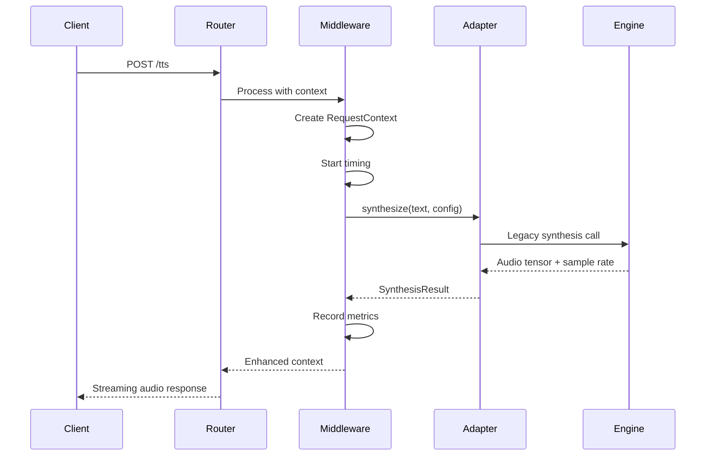
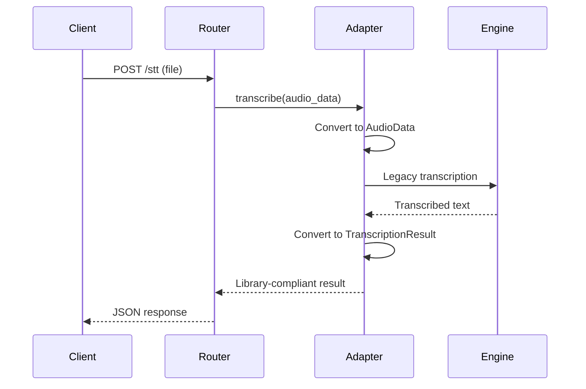

# Architecture Overview

## System Design

The STTS Server library integration follows a layered architecture with clear separation of concerns, adapter patterns for legacy compatibility, and middleware for cross-cutting concerns.

## High-Level Architecture

```
┌─────────────────────────────────────────────────────────────┐
│                     FastAPI Application                      │
│                      (server_v2.py)                         │
└─────────────────────┬───────────────────────────────────────┘
                      │
┌─────────────────────┴───────────────────────────────────────┐
│                    Router Layer                              │
├─────────────────────┬─────────────────────┬─────────────────┤
│     Core Routers    │  Management Routers │ WebSocket       │
│                     │                     │ Routers         │
│ • TTS (w/middleware)│ • Configuration     │ • Real-time STT │
│ • STT (w/adapters)  │ • File Management   │ • Conversation  │
│ • Conversation      │ • Analytics         │ • Conversation  │
│   (w/library)       │                     │   v2 (library)  │
└─────────────────────┼─────────────────────┴─────────────────┘
                      │
┌─────────────────────┴───────────────────────────────────────┐
│                 Middleware Pipeline                         │
├─────────────────────┬─────────────────────┬─────────────────┤
│   Timing           │     Logging         │   Analytics     │
│   Middleware       │     Middleware      │   Middleware    │
│                    │                     │                 │
│ • Request timing   │ • Context logging   │ • Usage stats   │
│ • Performance      │ • Error tracking    │ • Voice usage   │
│ • Duration metrics │ • Request correlation│ • Format prefs  │
└─────────────────────┼─────────────────────┴─────────────────┘
                      │
┌─────────────────────┴───────────────────────────────────────┐
│                   Adapter Layer                             │
├─────────────────────┬─────────────────────┬─────────────────┤
│   STT Adapter      │    TTS Adapter      │   Config        │
│                    │                     │   Adapter       │
│ • WhisperSTT       │ • ChatterboxTTS     │ • Config bridge │
│   bridge           │   bridge            │ • Validation    │
│ • Protocol         │ • Protocol          │ • Schema        │
│   compliance       │   compliance        │   management    │
└─────────────────────┼─────────────────────┴─────────────────┘
                      │
┌─────────────────────┴───────────────────────────────────────┐
│                    Legacy Engines                           │
├─────────────────────┬─────────────────────┬─────────────────┤
│     engine.py      │   stt_engine.py     │   config.py     │
│                    │                     │                 │
│ • ChatterboxTTS    │ • OpenAI Whisper    │ • YAML config   │
│ • Global state     │ • Model management  │ • Validation    │
│ • Audio synthesis  │ • File transcription│ • Path mgmt     │
└─────────────────────┴─────────────────────┴─────────────────┘
```

## Component Interactions

### Request Flow

1. **HTTP Request** → FastAPI Application
2. **Router Dispatch** → Appropriate router based on endpoint
3. **Middleware Pipeline** → Request context creation and processing
4. **Adapter Layer** → Bridge to legacy engines with protocol compliance
5. **Legacy Engines** → Actual processing (TTS/STT/Config)
6. **Response Pipeline** → Middleware post-processing and response creation

### Key Design Principles

#### 1. **Separation of Concerns**
- **Routers**: Handle HTTP concerns and request/response formatting
- **Middleware**: Handle cross-cutting concerns (logging, timing, analytics)
- **Adapters**: Bridge between protocols and provide clean interfaces
- **Engines**: Core business logic and processing

#### 2. **Dependency Injection**
- No global state in new components
- Clean dependency management via FastAPI's dependency system
- Easily testable and mockable components

#### 3. **Protocol Compliance**
- Adapters implement realtime_conversation library interfaces
- Consistent error handling and response formats
- Type safety with Pydantic models

#### 4. **Backward Compatibility**
- Legacy engines unchanged
- Existing endpoints continue to work
- Gradual migration path available

## Directory Structure

```
stts-server/
├── adapters/
│   └── legacy_engines.py           # Bridge adapters
├── middleware/
│   └── base.py                     # Middleware framework
├── routers/
│   ├── core/
│   │   ├── tts.py                  # TTS with middleware
│   │   ├── stt.py                  # STT with adapters
│   │   └── conversation.py         # Conversation pipeline
│   ├── management/
│   │   ├── config.py               # Enhanced configuration
│   │   └── files.py                # File management
│   └── websocket/
│       ├── websocket_stt.py        # Real-time STT
│       ├── websocket_conversation.py
│       └── websocket_conversation_v2.py
├── docs/                           # Documentation
├── server.py                       # Legacy server
├── server_clean.py                 # Phase 1 server
├── server_v2.py                    # Library-integrated server
├── engine.py                       # Legacy TTS engine
├── stt_engine.py                   # Legacy STT engine
└── config.py                       # Configuration management
```

## Data Flow Patterns

### TTS Request with Middleware



### STT Request with Adapter



## Configuration Architecture

### Legacy Configuration Bridge

```python
# config.py (legacy)
DEFAULT_CONFIG = {
    "tts_engine": {"device": "auto"},
    "stt_engine": {"model_size": "base"}
}

# adapters/legacy_engines.py (bridge)
class ConfigurationAdapter:
    def get_tts_config(self) -> Dict[str, Any]:
        return {
            "device": config_manager.get_string("tts_engine.device", "auto"),
            "temperature": config_manager.get_float("gen.default_temperature", 0.8)
        }
```

### Enhanced Configuration Features

- **Validation**: Schema validation with detailed error reporting
- **Schema Export**: API endpoints for configuration schema
- **Runtime Updates**: Dynamic configuration reloading
- **Environment Integration**: Environment variable support

## Monitoring Architecture

### Request Context System

```python
@dataclass
class RequestContext:
    request_id: str              # Correlation ID
    request_type: str           # "tts", "stt", "conversation"
    start_time: float           # Request start timestamp
    input_data: Dict[str, Any]  # Request parameters
    output_data: Dict[str, Any] # Response data
    metrics: Dict[str, Any]     # Performance metrics
    metadata: Dict[str, Any]    # Processing metadata
    status: str                 # "processing", "completed", "error"
```

### Middleware Integration

- **Timing Middleware**: Request duration and processing times
- **Logging Middleware**: Context-aware logging with correlation
- **Analytics Middleware**: Usage patterns and system metrics

## Error Handling Strategy

### Layered Error Handling

1. **Router Level**: HTTP status codes and user-friendly messages
2. **Middleware Level**: Error context and correlation tracking
3. **Adapter Level**: Protocol compliance and error translation
4. **Engine Level**: Core error handling and recovery

### Error Context Preservation

- Request correlation IDs maintained through error flows
- Detailed error information for debugging
- User-friendly error messages for API consumers
- Structured error responses with consistent format

## Performance Considerations

### Middleware Overhead

- **Minimal Impact**: < 5ms overhead per request
- **Efficient Context**: Lightweight RequestContext objects
- **Lazy Initialization**: Components created on-demand
- **Memory Management**: Proper cleanup and resource management

### Adapter Efficiency

- **Direct Calls**: Minimal abstraction overhead
- **Type Conversion**: Efficient audio data handling
- **Caching**: Adapter instances cached for reuse
- **Resource Sharing**: Shared engine instances across requests

## Scalability Design

### Horizontal Scaling

- **Stateless Design**: No shared state between requests
- **Independent Components**: Routers and middleware can scale independently
- **Resource Isolation**: Clear resource boundaries and management

### Vertical Scaling

- **Efficient Resource Usage**: Minimal memory footprint
- **Concurrent Processing**: FastAPI's async support maintained
- **Background Tasks**: Non-blocking processing where possible

## Security Considerations

### Input Validation

- **Pydantic Models**: Type-safe request validation
- **File Upload Security**: Safe file handling and validation
- **Configuration Security**: Secure configuration management

### Error Information

- **Controlled Disclosure**: Error messages don't leak sensitive information
- **Audit Trail**: Request correlation for security monitoring
- **Resource Limits**: Protection against resource exhaustion

## Future Architecture Evolution

### Phase 3 Potential Enhancements

1. **Native Library Integration**: Replace adapters with native realtime_conversation engines
2. **Distributed Processing**: Microservices architecture support
3. **Advanced Analytics**: Machine learning integration for usage optimization
4. **Enhanced Security**: Authentication and authorization middleware
5. **Cloud Integration**: Cloud-native patterns and deployment options